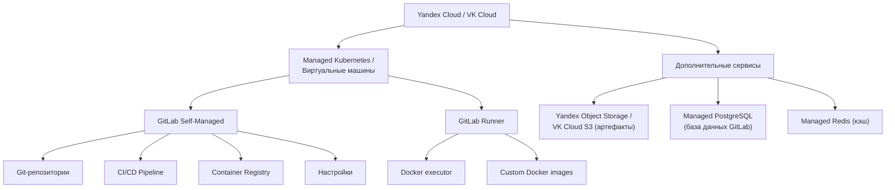
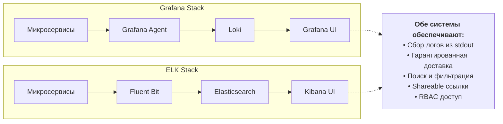
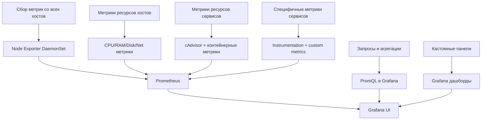

# Задача 1: Обеспечить разработку
## Предложите решение для обеспечения процесса разработки: хранение исходного кода, непрерывная интеграция и непрерывная поставка. Решение может состоять из одного или нескольких программных продуктов и должно описывать способы и принципы их взаимодействия.

## Решение должно соответствовать следующим требованиям:

*  облачная система;
*  система контроля версий Git;
*  репозиторий на каждый сервис;
*  запуск сборки по событию из системы контроля версий;
*  запуск сборки по кнопке с указанием параметров;
*  возможность привязать настройки к каждой сборке;
*  возможность создания шаблонов для различных конфигураций сборок;
*  возможность безопасного хранения секретных данных (пароли, ключи доступа);
*  несколько конфигураций для сборки из одного репозитория;
*  кастомные шаги при сборке;
*  собственные докер-образы для сборки проектов;
*  возможность развернуть агентов сборки на собственных серверах;
*  возможность параллельного запуска нескольких сборок;
*  возможность параллельного запуска тестов.
## Обоснуйте свой выбор.

# Ответ

Ну по очевидным причинам это должны быть отечественные клауд провайдеры. 
А ближайший аналог AWS это как раз вроде яндых =) ещё и с Российской юрисдикцией
может и VK Cloud подойдёт.. но я его не юзал ниразу.

# Задача 2: Логи
## Предложите решение для обеспечения сбора и анализа логов сервисов в микросервисной архитектуре. Решение может состоять из одного или нескольких программных продуктов и должно описывать способы и принципы их взаимодействия.
## Решение должно соответствовать следующим требованиям:
*  сбор логов в центральное хранилище со всех хостов, обслуживающих систему;
*  минимальные требования к приложениям, сбор логов из stdout;
*  гарантированная доставка логов до центрального хранилища;
*  обеспечение поиска и фильтрации по записям логов;
*  обеспечение пользовательского интерфейса с возможностью предоставления доступа разработчикам для поиска по записям логов;
*  возможность дать ссылку на сохранённый поиск по записям логов.

## Обоснуйте свой выбор.
# Ответ

Я бы выбрал Grafana потому что UI удобнее =) ну и дашборды отличаются , в Grafana они функциональнее в реальном времени и с динамическими переменными справляются лучше чем в Kibana.

# Задача 3: Мониторинг
## Предложите решение для обеспечения сбора и анализа состояния хостов и сервисов в микросервисной архитектуре. Решение может состоять из одного или нескольких программных продуктов и должно описывать способы и принципы их взаимодействия.
## Решение должно соответствовать следующим требованиям:

*  сбор метрик со всех хостов, обслуживающих систему;
*  сбор метрик состояния ресурсов хостов: CPU, RAM, HDD, Network;
*  сбор метрик потребляемых ресурсов для каждого сервиса: CPU, RAM, HDD, Network;
*  сбор метрик, специфичных для каждого сервиса;
*  пользовательский интерфейс с возможностью делать запросы и агрегировать информацию;
*  пользовательский интерфейс с возможностью настраивать различные панели для отслеживания состояния системы.
## Обоснуйте свой выбор.

# Ответ

Ну так как во второй задаче берём Grafana то ... надо использовать Prometheus =) 
P.S (Ну и ранее на курсе настраивали Grafana\Prometheus и ELK , Grafana мне показалась сильно удобнее) 

# Доработка
*    Почему нельзя рассмотреть архитектуру, где используется cloud.ru, Jenkins, Nexus,Registry.
*    У вас странная и неинформативная диаграмма. Сравните буквально эти 2 решения.
*    Почему вы избегаете Zabix?

# Ответ 
По поводу промтов, да юзал, для помощи с mermaid.js для оформления.. но как показала практика надо было просто в голом md табличкой сделать как в прошлом задании =) (Эксперементировал) 
*кусок кода mermaid:*

    Req1["Сбор метрик со всех хостов"] --> Sol1["Node Exporter DaemonSet"]
    Req2["Метрики ресурсов хостов"] --> Sol2["CPU/RAM/Disk/Net метрики"]
    Req3["Метрики ресурсов сервисов"] --> Sol3["cAdvisor + контейнерные метрики"]
    Req4["Специфичные метрики сервисов"] --> Sol4["Instrumentation + custom metrics"]
    Req5["Запросы и агрегации"] --> Sol5["PromQL в Grafana"]
    Req6["Кастомные панели"] --> Sol6["Grafana дашборды"]

Сравниваем cloud.ru - Jenkins - Nexus - Registry & Yandex.cloud - Managed Kubernetes - GitLab self-managed - GitLab Runner:
| Требования | cloud.ru | Yandex.cloud | Вывод |
|------------|----------|--------------|-------|
|Сборка по событию|Можно сказать "Из коробки"|Требует неких манипуляций с Jenkins|Gitlab с родными триггерами .gitlab-ci.yml удобнее|
|Запуск сборки вручную| Отлично | Отлично | Паритет (Что касается UX отдам предпочтение Gitlab)|
|Шаблоны для разных конфигураций|include:project / component / local + CI/CD templates|Shared Libraries + Job DSL / scripted| YAML - проще и читаемее  Groovy более гибкий так же более сложный насколько мне известно в Gitlab с отладкой чуть сложнее|
|Несколько конфигураций сборки из одного репозитория|rules: / workflow:rules / variables по MR / branch / tag|Multi-branch pipeline + when:expression|И снова стукаемся об YAML и Groovy|
|Кастомные шаги|.gitlab-ci.yml — любой скрипт / docker / kubernetes executor|Groovy / declarative pipeline| у Jenkins больше возможностей для кастомизации|
|Общее количество компонентов в продакшене|3–4 (GitLab VM + Runner'ы + Managed K8s)|5–7 (Jenkins master + agents + Nexus + Registry + Git-сервер)| Gitlab в эксплуатации проще|

Обьясню свою логику, т.к в данный момент работаю сисадмином , то сложилось такое вот мнение что нагружать самого себя и инфраструктуру без явных на то причин за частую не имеет смысла, из чего вытекает что для более чего то сложного нужно куда больше экспертных знаний , а значит затрачиваемых "человекачасов" на поддержание, приведу простой но понятный пример из личного опыта. 
На работе используется Mesh central для удалённого управления , мониторинга (базовый минимум, больше ненужно просто) а так же для удалённого развёртывания в данном примере возьмём 1с платформу и обновление.  
Не хочется же бегать по территории на каждый из 400+ рабочих станций и ставить ручками, можно для этой цели юзать GPO (с костылями) но возможно, либо сильно заморочиться и поднять ansible писать плэйбуки на разные сценарии 
на уровне погрешности юзая Ansible из 400+ хостов , обновление не доходило примерно до 30-50 , приходилось их одтельным списком , удалять то что накаталось и заливать снова (может не хватало экспертизы в ansible )  
но Mesh central предлагает всё это "из коробки" c удобной вебмордой и возможностью точечно подключаться к хосту и вносить правки.  Что сильно ускоряет подчеркну в конретно этом случае.

Потому и сделал следующий вывод цитируя легендарных личностей:  можно ли юзать Ansible ?  Можно! Зачем?  
Поэтому да, считаю что чем решение проще тем и лучше, но надо учитывать слишком много факторов для окончательного выбора в ту или иную сторону. 

Про Zabbix скажу так, у Zabbix есть просадки в работе с микросервисной архитектурой тогда как стак Grafan\ELK длелася под эти задачи.
Zabbix SQL сильно отстаёт по удобвсту и скорости PromQL на пример.
Кастомные метрики в случае с большим кол-вом pod'ов .. ну такое себе.

В Kubernetes новый под поднимается - умирает - поднимается с другим IP/именем 
В Zabbix нужно либо
*    ставить agent в каждый под (ресурсоёмко),
*    либо использовать HTTP-агенты (Костыль, никто не любит костыли) 

